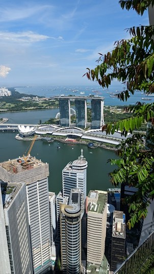
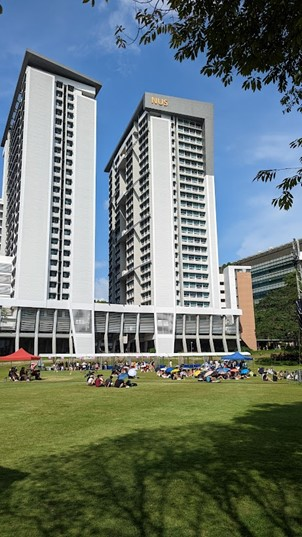
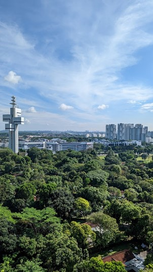

# Albin Westlin

Universitet: National University of Singapore  
Termin: HT 2022  
Inriktning: Kemi

## Innan avresa

Jag har alltid tyckt att det är en fantastisk möjlighet att få åka på utbyte som jag tycker att alla bör ta för att få nya erfarenheter, uppleva en annan kultur och träffa nya människor. Jag valde universitetet NUS i Singapore eftersom det är ett av Asiens främsta universitet och Singapore är en spännande stad med en unik kultur som jag inte tidigare hade upplevt. Jag hade förväntningar på ett högt studietempo med utmanande kurser, men samtidigt ville jag också ha tid att utforska staden och göra annat än att plugga. Förberedelser jag behövde göra inkluderade att söka kurser, ta diverse vaccin och ansöka om studentvisum. Vaccin är frivilligt men eftersom jag ville resa i Asien efter utbytet tyckte jag det var värt att ta trots kostnaden. Jag tog de rekommenderade vaccinen som går att hitta på exempelvis sveavaccin. Processen att ansöka till universitet och ICA (Immigration & Checkpoints Authority) är ganska lång och förvirrande eftersom man får väldigt mycket information från olika håll. Var beredd på att lägga lite tid på det och hitta gärna andra studenter som också ska till Singapore så att ni kan hjälpas åt så att ingen glömmer något steg i processen.

## Ankomst

Jag infann mig i Singapore en vecka innan studiestart för att utforska staden innan skolan började. Det fanns ingen organiserad övergripande mottagning när jag åkte dit (vilket kan bero på att det nyligen varit pandemi och vissa regler och bestämmelser fortfarande gällde när jag kom dit), men däremot en mängd aktiviteter, studentmässor och evenemang i början av terminen där vi fick träffa andra studenter och lära känna skolan. Jag fick också hjälp med att hitta en fadder som kunde visa mig runt och ge råd under min vistelse.

## Ekonomi

Jag fick stipendier från Gålöstiftelsen och KTHs resestipendium för att finansiera mina studier. Kostnadsläget i Singapore är mycket högt, särskilt när det gäller boende, så det var bra att jag hade dessa stipendier. En av få saker som är billiga i Singapore är att äta mat ute, på så kallade Hawker centres. De liknar food courts och finns lite överallt, även på campus. Vanliga restauranger i Singapore har dock priser likt de i Sverige.

## Boende

Jag hade tur och fick boende i UTown som ligger på campus, vilket var smidigt och gjorde transport enkelt. Boendestandarden var någorlunda hög och på campus hade jag tillgång till allt jag behövde. I UTown finns bland annat idrottshall, dansstudio, gym, butiker, restauranger, studieytor och en pool. På resten av campus finns ännu mer möjligheter för sport/aktiviteter/med mera. Bostadspriserna i Singapore är som sagt mycket höga, så jag skulle rekommendera att söka boende på campus, men vara beredd på att få söka utanför skolan eftersom skolan inte har tillräckligt med boenden för alla utbytesstudenter. Var beredd på att det kan bli dyrt att bo utanför campus, åtminstone 2-3 gånger priserna i Stockholm.

    
      

_Gräsytan på UTown med UTown Residence där jag bodde i bakgrunden, samt vyn från fönstret i mitt rum_

## Universitetet och studierna

NUS är ett stort universitet som erbjuder en mängd olika program inom de allra flesta områden, bland annat Science och Engineering vilket var det som jag läste. NUS skiljde sig från KTH genom att ha en mer internationell miljö och ett mer levande campusliv. En vanlig dag på NUS innebar att jag hade några timmars föreläsningar, övningar eller laborationer inom mina valda ämnen, samt tid för självstudier och grupparbeten. All undervisning skedde på engelska.

## Kurser

Jag valde att läsa följande kurser: MA3209, MA3205, CN4125R, CN3421A, och LSM1301. Detta är kurser inom matematik, kemi och biologi och det går att läsa mer om dessa kurser och skolans kursutbud på nusmods.com. Dessa kurser var intressanta och utmanande, och jag planerar att inkludera dem i min examen från KTH. Det var svårt att få precis de kurser jag ville ha då det är hög konkurrens bland kursplatserna. Jag sökte 8 kurser vilket är maxantalet som går att söka, och fick först bara 3 av dem. De 2 andra kurserna jag läste gick att lägga till senare. Språkkurser var också tillgängliga på NUS. Notera att man måste komma in på minst 3 kurser för att få läsa som utbytesstudent på NUS.

## Staden och landet

Staden Singapore upplevdes som mycket modern och välutvecklad. Kulturen i Singapore är en unik blandning av olika influenser från malayiska, kinesiska, indiska och européiska kulturer. Jag kände inte att jag upplevde några stora kulturkrockar, men jag lärde mig mycket om den lokala kulturen genom att prata med medstudenter och delta i olika evenemang.

    
      

_Vy över Marina Bay Sands från högsta våningen på Capita Springs, samt kvällsvy från Marina Bay Sands tillbaka mot staden_

## Fritid och sociala aktiviteter

På fritiden i Singapore hade jag många olika alternativ för att hålla mig sysselsatt. Universitetet erbjöd ett brett utbud av aktiviteter inom bland annat sport och musik, där jag valde att spela pickleball. Utbudet av kultur var också imponerande, med många parker, museer och andra sevärdheter att utforska. Jag fick också bra kontakt med andra studenter och deltog i olika sociala aktiviteter tillsammans med dem. När de allra flesta utbytesstudenter anländer till Singapore är det nationaldagsfirande vilket kan vara intressant att ha sett.

## Hållbarhet

Det var ganska enkelt att resa hållbart till och från NUS, eftersom universitetet ligger nära olika kollektivtrafikalternativ som tåg och bussar. Det finns vissa initiativ för att främja hållbarhet på skolan, men över lag upplever jag att det i Sverige finns en högre medvetenhet och större vilja att främja hållbarhet än i Singapore. Exempelvis kan du få dina varor paketerade i 5–6 plastpåsar när du handlar något som eventuellt bara hade krävt en påse.

## Rekommendationer och övriga reflektioner

Jag skulle rekommendera andra att åka på utbyte till NUS, eftersom universitetet erbjuder högkvalitativ utbildning och en spännande internationell miljö. Det kan också vara en bra idé att försöka hitta boende på campus, eftersom det kan underlätta transport och göra studierna billigare. Andra stipendiefonder än dem jag nämnde tidigare kan också vara värda att undersöka. Några exempel är Henrik Göranssons stipendiefond och Anna Whitlocks minnesfond.
För frågor, hör av dig till [albinwes@kth.se](mailto:albinwes@kth.se)
