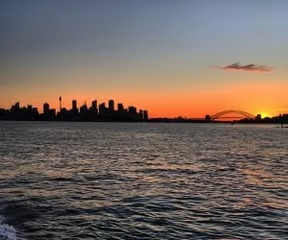
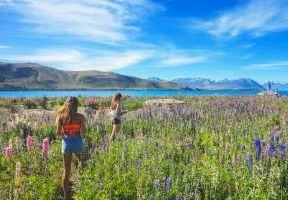
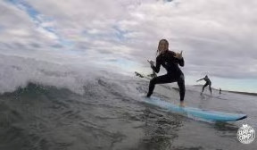
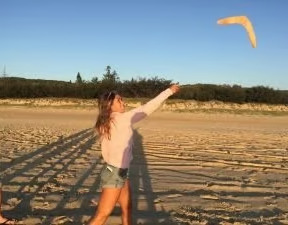

# Anna Stolpe – Australien

Universitet: University of Wollongong  
Termin: HT 2016  
Inriktning: Energi och Miljö

## Innan avresa

Jag sökte utbytesstudier för att det är en helt otrolig möjlighet att få resa och uppleva nya miljöer, kulturer och människor utan att behöva göra något uppehåll i studierna hemma i Sverige. Jag tyckte dessutom att det skulle bli väldigt spännande att just plugga i ett annat land och uppleva eventuella skillnader studiemässigt.

Australien var givet redan innan jag ansökte. Jag har nämligen alltid velat åka dit men inte haft tiden ännu. Att det blev just University of Wollongong var inte lika självklart. Jag hade aldrig hört talas om Wollongong innan jag sökte men redan efter att ha läst den första reseberättelsen från en tidigare KTH-student kände jag att just den staden lockade. Det är en mindre stad, ca 300 000 invånare. Jag kommer ursprungligen från Uppsala och ville ha en lite mindre stad för att lättare känna mig hemma och även kunna ta sig runt snabbare. Men framför allt var det hela tiden avståndet till havet (vilket innebär SURFING!) som avgjorde min rangordning i ansökningen. Wollongong ligger precis vid havet och stränderna löser av varandra i både sydlig och nordlig riktning.

Eftersom det är ett engelskspråkigt land behövde jag inte ta någon språkkurs. Jag behövde heller inte ta några vaccinationer men jag har rest en del i Asien tidigare och hade därför sedan tidigare en del. Så just vaccinationer kan vara värt att kolla upp. Visum måste sökas. Man söker ett student visa online via Australian Governments hemsida. När man väl har förstått exakt vilket man ska söka var det väldigt smidigt och jag fick det bara några minuter efter ansökningen. Visumet är kopplat elektroniskt till ditt pass så man behöver inte ha några speciella papper med sig.

## Ankomst

Första dagen på orientation week, vilket är en slags introduktionsvecka kombinerat med ”nollning”, var 18:e juli och jag kom till Wollongong den 14:e. Det kändes väldigt lagom för då hann jag komma iordning lite, införskaffa lägenhetsprylar m.m. och även resa runt lite i närmsta området innan schemat blev fullproppat med aktiviteter och nya möten. Under o week sker själva inskrivningen och alla internationals välkomnas i en stor sal med både viktig information angående studierna men också erbjudanden om roliga aktiviteter. Under o week sker även rundvandringar kring campus och otroliga mängder föreningar berättar om vad de sysslar med och bjuder ofta på gratismat. Man har också tid till att uppsöka olika institutioner för att få nya kurser godkända eller diskutera kurser. Föreläsningarna började en vecka senare och de så kallade tutorials ytterligare en vecka senare. De två första veckorna har man möjlighet att prova fler kurser än man egentligen tänkt läsa för att sedan göra sitt slutgiltiga val någon gång vid vecka tre.

När man ansökte till University of Wollongong som utbytesstudent hade man möjligheten att få kontaktuppgifter till en buddy som redan studerar där och därför kunde svara på diverse frågor och komma med tips och råd.

## Ekonomi

Jag fick 8000 kronor i resebidrag av KTH. Utöver det sökte jag tre andra stipendier och fick ett av dem. Om man har tid och ork finns det otroligt många stipendier att söka så på så vis kan man verkligen spara pengar. CSN erbjuder dessutom ett merkostnadslån vilket innebär att jag fick ca 2000 kronor mer varje månad.

Jag anser att priserna i Australien är jämförbara med svenska, varken högre eller lägre. Vardagskostnaderna blev därför desamma som i Sverige men eftersom man vill utnyttja utbytesterminen till fullo la jag mycket pengar på aktiviteter både under och efter terminen.

Jag valde att bo på campusboende vilket jag visste skulle vara mycket dyrare än att försöka hitta något eget. Jag ångrar absolut inte mitt val för jag träffade otroligt mycket vänner via boendet och det anordnades alla möjliga aktiviteter där. Jag betalade 305 dollar i veckan vilket motsvarar ca 8000 kronor i månaden så om man vill spara pengar är ett tips att inte välja campusboendet. Har man har tur kan man hitta annat boende för 100 dollar mindre per vecka men då ska man ha lite is i magen också.

## Boeende

I anknytning till ansökan till University of Wollongong kan man även ansöka om campusboende vilket jag gjorde. Det finns nio olika campusboenden runt om i staden. En del har blandat bachelor- och masterstudenter, en del har bara det ena. Jag bodde på Kooloobong vilket är det som ligger närmast själva universitetet. Bokstavligt talat bara ett stenkast ifrån. Det var väldigt skönt att slippa matlådor för en termin eftersom man kunde springa hem och äta (men universitetsområdet är väldigt lummigt och mysigt så det är inget problem att fördriva tid där heller).

Kooloobong har både en ny och en äldre, väldigt mycket slitnare del. Jag hade turen att få en studio i den nya delen. Där var allt väldigt fräscht. I den nya delen kan man antingen bo i en delad lägenhet med fyra andra eller ha en helt egen studio. Studion är såklart dyrare och man ska veta att man måste införskaffa precis allt. Det som finns är en säng (ej täcke och kudde), ett bord, en stol ett kök (inte ett endaste köksredskap) och ett badrum. Jag sökte i första hand till en delad lägenhet där alla har varsitt rum men man delar kök och badrum. Då kan man ju dela på kostnaderna för alla köksredskap tex. Det finns även större gemensamma kök där alla som vill får laga mat, gemensamma pluggytor och pluggrum, en stor uteplats med bord och grill, en liten basketplan, ett musikrum och en källare med pingisbord.

Kooloobong är även bra på att arrangera olika slags aktiviteter flera gånger i veckan. Några exempel är morning yoga 7-8 på måndagsmorgnar, tea with TED talks på måndagskvällar, Friday fitness på fredagseftermiddagar och Travel diaries då internationella studenter bjöd på något traditionellt ätbart från sitt hemland.

Trots kostnaderna rekommenderar jag verkligen Kooloobong för att jag hade så roligt och fick så många vänner via boendet. Ett minus är dock att det ligger ca 3 km från stranden vilket betydde att man antingen fick ta (gratis-) bussen, ragga skjuts (alla australiensare är supersnälla så man får enkelt skjuts), traska, köpa en cykel eller springa till stranden. När surfbrädorna skulle med var det dessvärre lite besvärligare pga. att man inte fick ta dem på bussen. För mig och min kompis innebar det ett flertal promenader med brädan under armen genom hela staden. Campus East ligger närmast stranden men har enligt rykten ganska mycket sämre boendestandard.

På Kooloobong bodde många internationals men även många australiensare vilket var väldigt roligt för att man då lärde känna folk från så många olika länder men också kunde umgås mycket med just australiensare. Skaffar man eget boende vet man såklart inte vilka man hamnar med och kan ha både tur och otur men min uppfattning är att det lätt blir att internationals bor tillsammans och då träffar man inte lika många australiensare som vi gjorde. Men som sagt handlar det om vad man hittar.

## Universitetet och studierna

Det går ca 36 000 studenter på University of Wollongong och det erbjuds kurser och program inom väldigt många olika ämnesområden. Jurister, ekonomer, sjuksköterskor och även kurser inom fotografering och bild men ett av de största områdena är engineering.

Undervisningsmässigt var det enligt mig ganska likt KTH men mindre schemalagd tid. Varje kurs hade en lecture (precis som en vanlig föreläsning på KTH) och en tutorial (mer som ett seminarium då eleverna är mer aktiva). Lectures är sällan obligatoriska och spelas ofta in så att man kan titta på dem online. Tutorials är däremot obligatoriska men under de två första veckorna väljer man själv en av tre tutorials för varje kurs. Man har på så vis möjlighet att till viss del pussla ihop sitt schema själv. Vanligtvis är att man försöker trycka ihop skolveckan för att få längre helger till roliga äventyr.

De flesta kurser avslutas med en sluttenta men den står oftast för bara 50 % av slutbetyget. Under terminens gång får man lite olika assignments som även dem är avgörande för slutbetyget. Det är endast en tentaperiod per termin vilket innebär att man har alla sluttentor under de två sista veckorna. Alla tutorials och lectures slutar en vecka före tentaveckorna så man har minst en hel vecka på sig innan första tentan kommer.

## Kurser

Mitt viktigaste tips är att göra ett ordentligt jobb när det kommer till att hitta lämpliga kurser. När jag ansökte till University of Wollongong kunde jag ansöka om sex kurser. Man läser bara tre eller fyra så jag trodde att det skulle ge tillräckliga valmöjligheter. Men pga. schemakrockar och svårigheter med jämförandet av kursbeskrivningar och förkunskaper kunde jag till slut bara läsa två av de sex jag hade ansökt till. Det är dock ganska lätt att byta kurser på plats under de första två veckorna men då var det mitt i sommaren i Sverige och därför väldigt svårt att kommunicera med KTH. Så se till att ha fått många kurser godkända av KTH innan du åker så du lättare kan hantera kursvalen.

En av kurserna jag läste hette ENGG378 Sustainable Energy Technologies. Den var väldigt svår men också väldigt givande. Man gjorde alla möjliga beräkningar anknutna till energikällorna vattenkraft, vågkraft, vindkraft, solkraft och biobränsle. Föreläsningarna bestod av både teori kring de olika energikällorna men även olika slags beräkningar och formler. Under veckans tutorial räknade man självständigt på övningsuppgifter. Kursen hade fyra examinationsmoment; ett mindre prov i början av terminen med 13 räknefrågor som behandlade energi, en uppsats om hur dagens klimatförändringar kan lösas med miljövänligare energikällor, ett grupparbete som gick ut på att göra beräkningar kring ett påhittat solkraftverk och sedan skriva en rapport om arbetet och slutligen en sluttenta med större räknefrågor inom alla energikällorna.

Min andra kurs hette SCIE103 Climate Change och behandlade jordens klimatförändringar, klimatsystem och fenomen. Kursen hade fyra examinationsmoment; ett online-test med multiple choice questions, en rapport där man skulle analysera data från olika faktorer och dess framtida klimatpåverkan, en uppsats då man skulle analysera riktiga nyhetsartiklar eller andra inslag angående klimatförändringar idag och slutligen en sluttenta med både multiple choice questions och skrivfrågor. I denna kurs fanns inga tutorials utan endast föreläsningar som i vissa fall kunde inkludera en aktivare del för studenterna.

Den tredje kursen jag läste var jag tvungen att ta på plats pga. ovan nämnda problem. Det var en engelskkurs som hette ELL 151 Effective Spoken Communication. Den kommer jag inte kunna tillgodoräkna men var trots det givande då vi övade bland annat presentation skills.

## Staden och landet

Jag tycker att Australien är helt fantastiskt. Det liknar Sverige i levnadssätt och samhällsmässigt så det är inga direkta kulturchockar. De märkbara skillnaderna är att alla är så otroligt trevliga. Det är verkligen inga konstigheter att plötsligt ha en konversation med någon man precis mötte på gatan, bussen eller stranden. Du kan alltid fråga om hjälp vart du än kommer och den du frågar kanske tom. kör dig till rätt destination! En annan skillnad är att alla avstånd är långa… Australien är större än hela Europa vilket gör att det blir längre sträckor att transportera sig vart man än ska. Klimatet är självfallet en märkbar skillnad det också. När jag kom till Wollongong den 14:e juli var det mitt i vintern men temperaturen varierade mellan 18-25 grader från första dagen. I Wollongong blir det aldrig riktigt hett som det kan bli längre in i landet och längre norrut. Under sommaren kan det bli upp till 35 grader men kan nästa dag vara 25 igen och det blåser även ganska mycket eftersom det ligger precis vid kusten.

Jag trivdes väldigt bra i Wollongong och var mycket nöjd med mitt val av stad. Som jag hade trott gjorde den lite mindre staden att man enklare kände sig hemmastadd och trots att vi bodde på campusboendet längst från stranden krävdes bara en 15 minuters busstur. Det går gratis bussar hela dagarna runt hela staden som därför tar en till Universitetet, stranden, matbutiker och city centre.

Det finns flera stränder längs kusten, en gågata med butiker, köpcenter och restauranger i city centre, en botanical garden och ett berg man kan hajka upp för precis vid Universitetet och själva universitetsområdet är supermysigt. Det var tidigare en botanical garden så det är lummigt med mycket grönområden, växtlighet, små dammar och mängder av diverse ankor, gäss och änder som vandrar omkring.

Många av de australiensare man lärde känna hade bil vilket ledde till att man kunde få åka med till ställen runt om Wollongong men även bara följa med och handla då och då. Jag klarade mig bra med gratisbussarna men borde såhär i efterhand ha skaffat en cykel det första jag gjorde.

För att komma till Sydney kan man enkelt ta ett tåg för ett par dollar (endast 2,5 = knappt 20 kronor på söndagar) som tar en dit på 1,5 timme.

## Fritid och sociala aktiviteter

Som sagt arrangerades mycket aktiviteter under första veckan (o week). En del var på Universitetet men mestadels var det via boendet Kooloobong för att alla skulle lära känna varandra. Traditionella namnlekar och speeddejting första dagen följt av smakprov på australiensisk mat så som känguru och krokodil. Vi hajkade upp för berget Mount Keira och spelade strandspel på stranden.

Även om det lugnade ner sig något när skolan drog igång hade Kooloobong aktiviteter under veckorna hela terminen ut som jag nämnde tidigare. Via universitetet finns möjligheter att gå med i alla möjliga slags föreningar så man behöver inte vara rädd att få för mycket fritid. Det erbjuds även olika slags workshops exempelvis för essay writing, academic language och CV-skrivning. Det finns ett stort gym på universitetet som verkligen erbjuder allt man kan tänka sig. Trots att jag är galen i träning valde jag att inte teckna något medlemskap där för att det var så dyrt. Dock erbjuds gratis badminton, tennis, basket, fotboll, volleyboll mm. vissa fasta tider. Så om det passar med sitt schema kan man göra allt ovan nämnt helt gratis. Jag försökte även ta vara på det fina vädret och tränade mycket utomhus med kompisar från Kooloobong. Vi arrangerade egna cirkelpass, sprang till stranden och surfade.

I början av terminen arrangerades ett par weekendresor för internationals med lite olika teman. Jag följde med på surflägret nere på Seven mile beach vilket var väldigt roligt och man lärde känna varandra bättre. Kooloobong arrangerade även en weekendresa till Blue Mountains där vi tältade och njöt av fantastiska vyer med berg och vattenfall. Självfallet blev det en del turer till Sydney och vi gjorde en mindre roadtrip en helg då vi besökte nationalparksområden både söder och norr om Wollongong.

I slutet av september hade vi spring break vilket innebar 10 dagars ledighet. Det utnyttjade vi till fullo och flög till Bali med ett mellanstopp i Singapore. Precis innan sluttentorna lyckades vi även trycka in en resa upp till Byron bay.

För alla studenter i Wollongong var det utgång mitt i veckan som gällde. Onsdagar och torsdagar är de dagar man vanligtvis går ut på. Det arrangeras speciellt avsatta bussar som kör studenter från campusboendena till klubbarna i stan och på onsdagar även tillbaka igen. Enligt min uppfattning kom man tillbaka hem igen tidigare än man vanligtvis gör hemma i Sverige vilket såklart var skönt eftersom man skulle upp till skolan morgonen efter.

När man är på utbytestermin vill man självfallet hinna uppleva så mycket som möjligt vilket jag också tycker att jag har gjort bra. Man hittar tid till att plugga också och alla är ju i samma sits så man kan sitta mycket tillsammans och plugga om man vill det men även isolera sig på det egna rummet eller i tysta studierum på biblioteket på universitetet. Även om det hela tiden finns många roliga aktiviteter som lockar är plugg ute i solen i Australien inte så dåligt det heller.

Min termin började redan i mitten av juli och slutade därför i mitten av november. Det innebar att jag hade två månader mellan min sista tenta och terminsstart på KTH igen. Den tiden utnyttjade jag till max. Jag började med att resa längs östkusten från Cairns till Brisbane med en kompis från Kooloobong. Från Brisbane flög vi sedan till Nya Zeeland där vi bilade runt med fem andra kompisar från Kooloobong. Vi var både svenskar, britter och en norsk. Jag firade jul i Melbourne (även där med kompisar från Kooloobong) och avslutade med tre veckor i Sydney-området så som Bondi, Coogee, Palm beach, Hunter valley och Manly. Det har varit ett helt fantastiskt halvår fyllt av nya vänskaper, upplevelser och erfarenheter och jag rekommenderar verkligen alla som får chansen att söka en utbytestermin att ta den.

    
    

