# Anton Sundberg - USA

Universitet: University of Illinois at Urbana-Champaign  
Termin: Vårterminen 2022  
Inriktning: MAFY

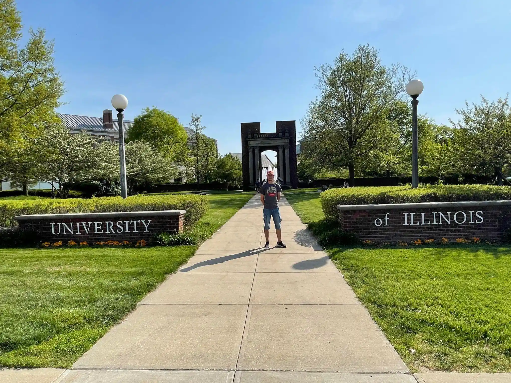

_Från slutet av terminen - är inte så här varmt året runt!_

## Innan avresa

Jag visste redan när jag sökte till CL att utbyte var av intresse för mig. Jag ville åka till ett engelsktalande land utanför Europa, så Nordamerika hamnade högt upp på listan.
Egentligen skulle jag ha åkt under den rekommenderade terminen, alltså hösten i årskurs 3, men på grund av svårigheter med COVID-19-pandemin och den amerikanska ambassaden så fick jag istället skjuta på det med en termin. Även om det resulterade i att mina VFU-perioder blev förskjutna med ett år så ansåg jag att det var värt det, och accepterade min nya plats.

Jag sökte och blev antagen till University of Illinois at Urbana-Champaign (UIUC) genom KTH, och sedan låg en bra del administration kvar för att all nödvändig info och dokumentation skulle nå fram till UIUC också. Jag fick tidigt i processen en webbportal med massa länkar och checkboxar som jag använde som min huvudsakliga utgångspunkt. Dessutom hade jag gått med i en chattgrupp med andra KTH-studenter som skulle till UIUC, vilket var väldigt hjälpsamt, då vi påminde varandra ofta om vad som behövde göras. Bland annat så behövdes visum och vaccin, men också ett par andra dokument. Annan administration var att söka KTH:s resebidrag, att boka flyg, och att leta upp och kontakta kring boende. Dessutom vill både KTH och UIUC ha en lista över preliminära kurser. Att åka till USA kräver en del dokumentation, så se till att vara ute i god tid!

## Ankomst

Jag anlände i mitten av januari, och åkte direkt till campus. Det går jättebra att stanna i Chicago på vägen efter en har flugit dit, men det var inget jag hann med. På grund av en tenta som jag hade, och som jag av KTH inte fick göra på distans, så var det ankomst lördag kväll, före skolstart på tisdag. Tyvärr var både söndagen och måndagen röda dagar, vilket gjorde att många kontor jag behövde besöka hade stängt. Det var ingen mottagning av något slag, vilket kan ha att göra med det faktum att det var vårtermin och/eller att COVID-19 fortfarande spökade. Dock var det ett digitalt infomöte några veckor före. Dessutom, eller kanske istället, så hade vi en “Orientation”-kurs, där vi fick en del information kontinuerligt genom våra första veckor.

De första dagarna fixade jag bl.a. med boende, telefonabonnemang, och registrering i skolans system, där vi också fick ett ID-kort. Att gå runt campus och närliggande gator för att bekanta sig med närområdet var också vad en del av tiden lades på.

    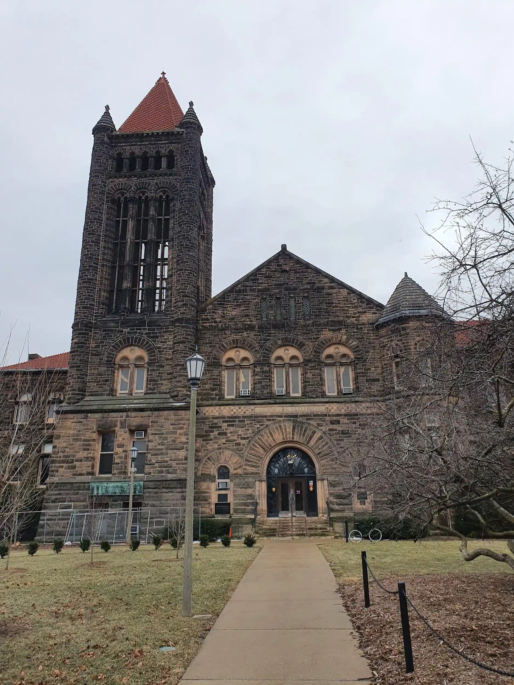
    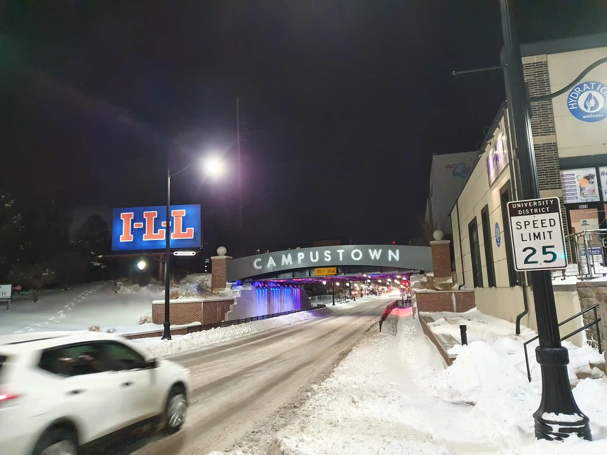  

_Matematikbyggnaden och en närliggande gata till campus_

## Ekonomi

Jag livnärde mig huvudsakligen på CSN och det resebidrag jag sökte och fick av KTH. Ursprungligen är det 6 000 kr för Nordamerika, men eftersom avtal ändrats mellan KTH och UIUC behövdes nu också en hälsoförsäkring som köptes via UIUC. Utökade blev då 10 000 kr, vilket nästan täckte hälsoförsäkringen och flygbiljetter tur och retur. Jag hade letat kort efter stipendier, men var nog för sent ute, så det slutade med att jag inte hann söka några. Den egna sparade kassan togs det också från, men märktes av mest under större resor. För vardagslivet klarade en sig ganska bra, även om det överlag är lite dyrare i USA - speciellt då man inte får glömma att dricks och köp-skatt tillkommer på mycket.

En stor besparing som effekt av att göra utbyte genom KTH är att inte behöva betala Tuition till UIUC, vilket sparar en upp emot 100 000 kr per termin - men det finns kostnader som utbytet inte täcker, bland annat Health Insurance, Health Service Fee, Transportation Fee, Recreation Fee, vilket landar på nästan 10 000 kr för en termin. De är obligatoriska, men för dem får en också tillgång till skolans sjukvård, idrottshallar, och transportnätverk.

## Boende

Jag bodde off-campus, i en lägenhet tillsammans med 3 andra amerikanska studenter. Jag var ute väldigt sent, och fick plats i sista rummet som det företaget jag hyrde via hade, och skrev inte på kontraktet förrän jag hade besökt lägenheten. Första dagarna efter ankomst spenderade jag på närliggande hotell. Det kändes lite körigt med boende för mig just eftersom jag hade tänkt att allting mest bara skulle lösa sig, så se till att vara ute i god tid med boende! Rent geografiskt bodde jag väldigt bra, med 10 minuters promenad till campus, och ett kvarter bort från närmsta mataffär, men klickade tyvärr inte så bra med mina rumskamrater. Min månadshyra var ungefär 5000 kr för ett eget rum i en 4-bed-2-bath-lägenhet.

    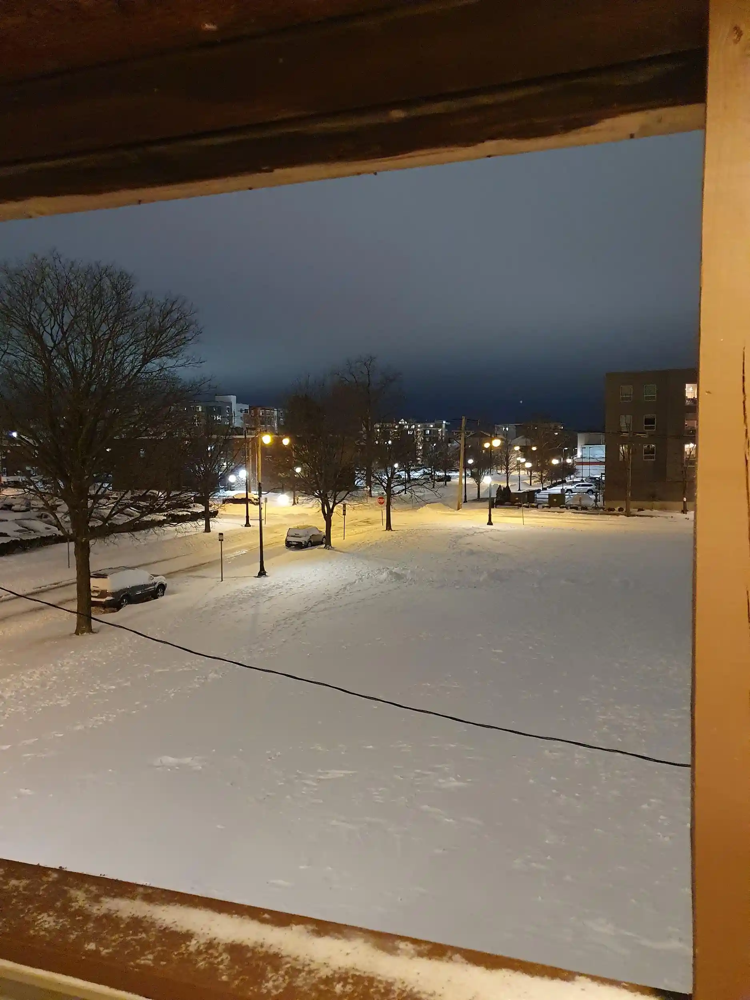
    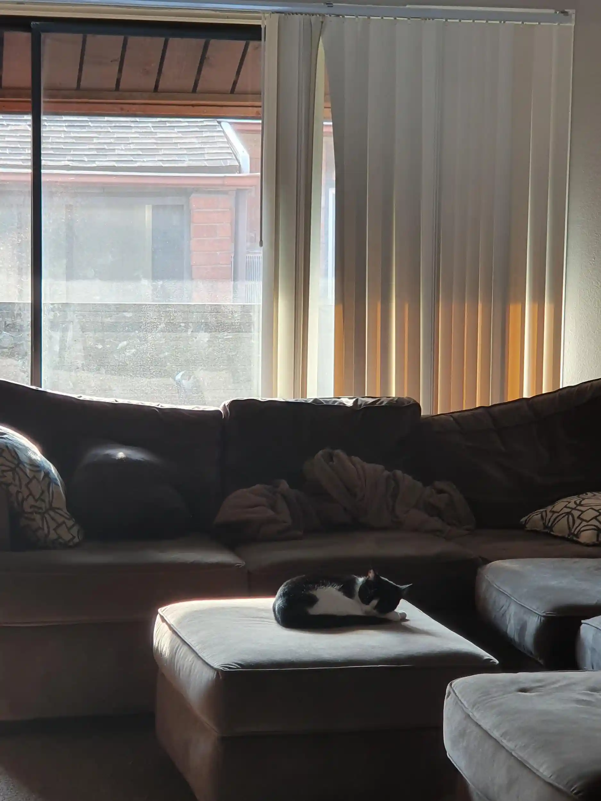  

_Till vänster - den gången vi fick en “snöstorm”, och till höger - vår huskatt_

## Universitetet och studierna

I stora drag är studierna ganska lika de på KTH, men det finns några undantag. Till en början så är examinationen uppdelad och kontinuerlig. Du har inte bara en tenta i slutet, utan ditt slutgiltiga betyg kan bestå av finals, midterms, homework, attendance, m.m. Vad det är och hur mycket det väger in varierar från kurs till kurs. Det finns heller inte några Övningar likt de vi har på KTH. Vill du ha hjälp med något lämpar det sig istället då att gå till “office hours”, där du direkt får prata med din professor. Det, blandat med de lite mindre grupperna (för mig omkring 20 personer i varje kurs), gör att det blir lite mer personligt. Tror att mina professorer i varje kurs hade lärt sig mitt namn efter bara några veckor.

Ens schema är regelbundet från vecka till vecka, och är något som en designar själv. Varje kurs har ett visst antal moduler, som är olika tider en kan välja att ta kursen. På så sätt får en pussla lite med sitt schema och välja vad som passar en själv bäst. 2 veckor efter kursstart ska det spikas, så fram tills dess har man lite möjlighet att prova sig fram efter vad som fungerar bäst.

Skolan och campus är stor, uppskattningsvis 4 gånger större än KTH, både till antal studenter och yta. Finns mycket att upptäcka på campus då, både byggnader för väldigt specifik akademia, men också olika trevliga uteplatser sen när vår och sommar kom. UIUC har även flera bra bibliotek med bra studieytor.

## Kurser

Jag läste 5 kurser under min termin, alla parallellt med varandra.

_ENG300 - Engineering Transfer Orientation_  
Den här kursen var obligatorisk för alla utbytesstudenter inom Engineering. Vi lärde oss både basala och banala saker, till exempel student-traditioner på campus och tips på vad du kan göra i närområdet, samtidigt som kursen var ett forum för oss att bekanta oss med andra utbytesstudenter. Å andra sidan hade vi också lektioner som gick igenom vad jul och thanksgiving var, samt hur du uttrycker dig i mejl till dina professorer.

_PHYS391 - Pedagogy Teaching Physics - Tillgodoräknad som valbar_  
En rolig och utmanande kurs! I kursen behövde jag vara en Learning Assistant i en av introduktionskurserna för de studenter som studerar fysik. För mig innebar det att assistera under laborationerna i den första mekanikkursen som de läser. Mellan att närvara på laborationerna så hade vi seminarier för alla Learning Assistants där vi hade samtal kring hur en bäst går tillväga för att eleverna ska få ut något av sina laborationer. Ganska likt många av de pedagogikkurser vi har hemma på KTH.

_MATH412 - Graph Theory - Tillgodoräknad som valbar_  
En djupdykning i grafteori! En del var bekant sedan innan (tänk Matte 5 eller Diskret Matematik), men det blev fort ganska så abstrakt. Kursen var utmanande och intressant, och med ganska många bevis.

_MATH357 - Number Theory - Tillgodoräknad som valbar_  
Talteori, en kurs med fokus på heltal. Även i den här så var vissa delar bekanta från Diskret Matematik. En blandning av bevisföring och egna beräkningar. Det här var den enda kursen som jag behövde skaffa en kursbok till, för att våra betygsgrundande hemuppgifter kom direkt från boken.

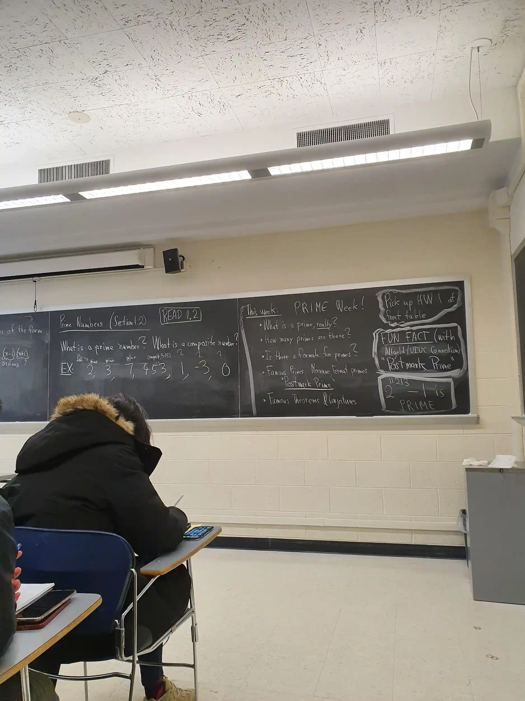

_Vi började med “Prime week”, för att sätta ton på kursen_

_CS346 - Numerical Methods I - Tillgodoräknad som Numeriska metoder, grundkurs IV_  
Numeriska metoder i Python. Fanns både att ta på plats och på distans. För att mitt schema skulle fungera som tänkte fick det bli den digitala varianten för mig, men det var ändå inslag av fysiska grupparbeten.

På grund av svårigheter med att hitta ekvivalenta kurser till vad jag annars läst samtidigt på KTH så valde jag att främst läsa kurser jag kan tillgodoräkna som valbara, med CS346 som undantag. Jag letade runt på skolans PHYS- och MATH-sidor, klickade på och sökte till det som såg mest intressant ut.

## Staden och landet

Finns inte så jättemycket att säga om staden faktiskt. Det är en campus town i Midwest-regionen, något som märks. Det är många studenter/ungdomar som går runt, och det är inte ett alltför stort område som definierar tätbebyggelsen. Omkring en är det platt så långt ögat kan se, och med en del majsfält. Väder och klimat är ganska jämförbart med Sverige, med ordentlig kyla på vintern och bra med värme på sommaren. Närmsta storstad är 2 timmar bort, åt något av 3 håll (Chicago, Indianapolis, St. Louis). Vill du uppleva något utanför det vanliga får du i regel resa bort från “Chambana”.

    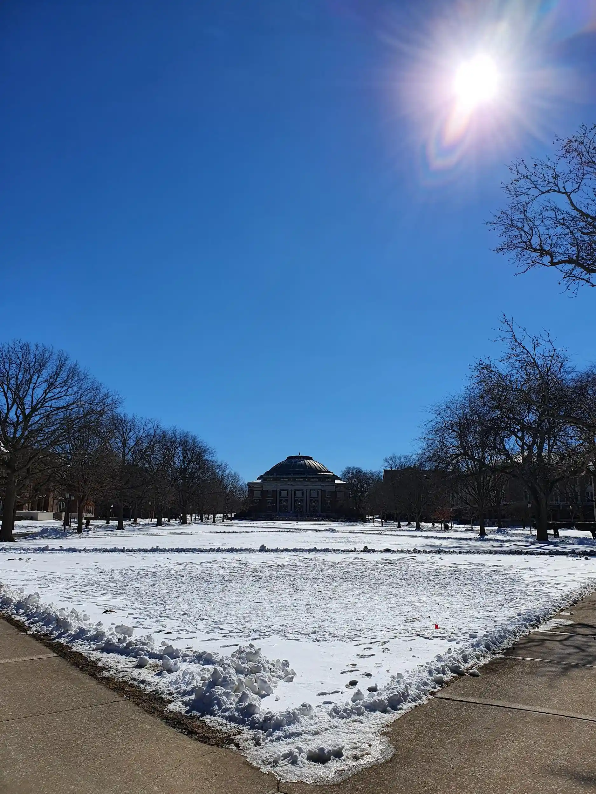
    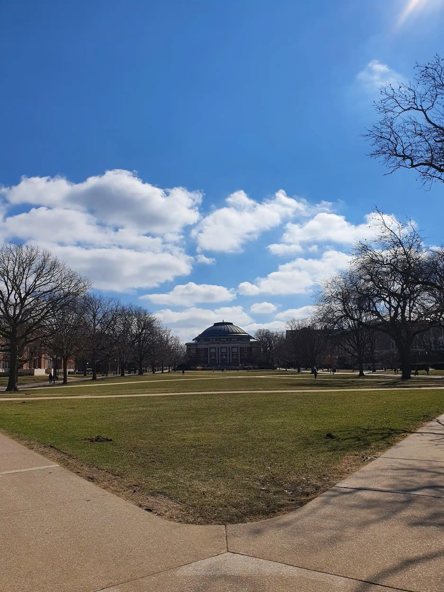  
    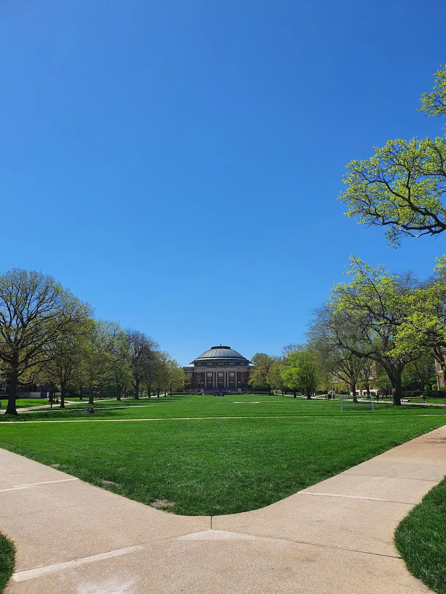  
    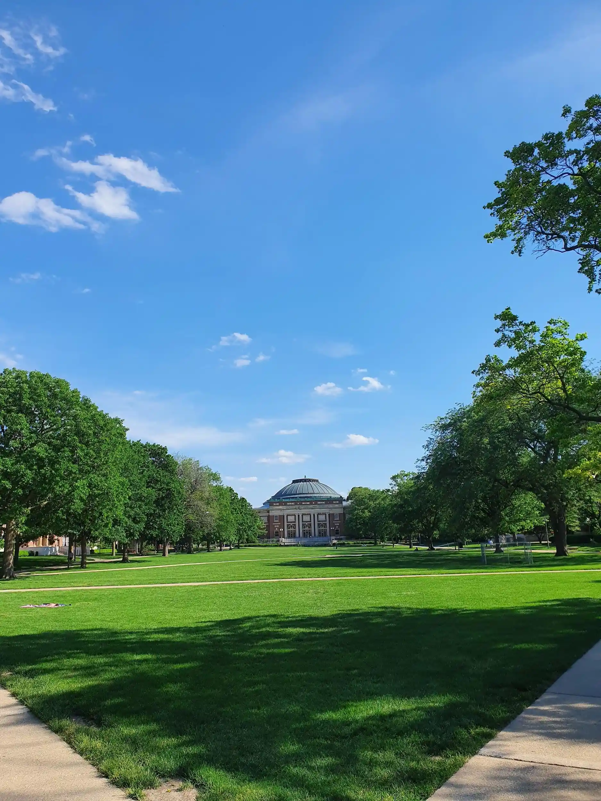  

_Så här såg vår Main Quad ut genom mina månader på campus_

USA som land är betydligt svårare att generalisera, eftersom att det är så pass stort - geografiskt är det storleksmässigt jämförbart med Europa. En försökte övertyga mig om att de även liknande kulturell spridning som i Europa, men där måste jag säga att han hade fel. En övergripande vänlig och social kultur finns i landet dock.

Jag reste lite kors och tvärs från Chambana, och tyckte om alla resor av sina egna anledningar, så troligtvis finns det någonstans i landet som faller de flesta i smaken. Bland annat åkte vi ett gäng svenskar till Miami under Spring Break, jag åkte till Chicago med en skara amerikanare, och efter terminens slut hade jag en egen road trip genom nationalparker i Utah.

    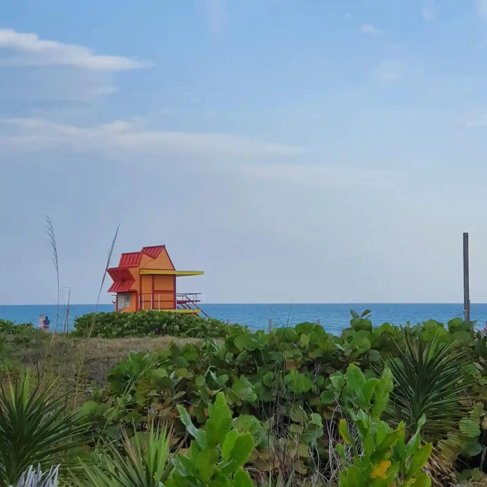
    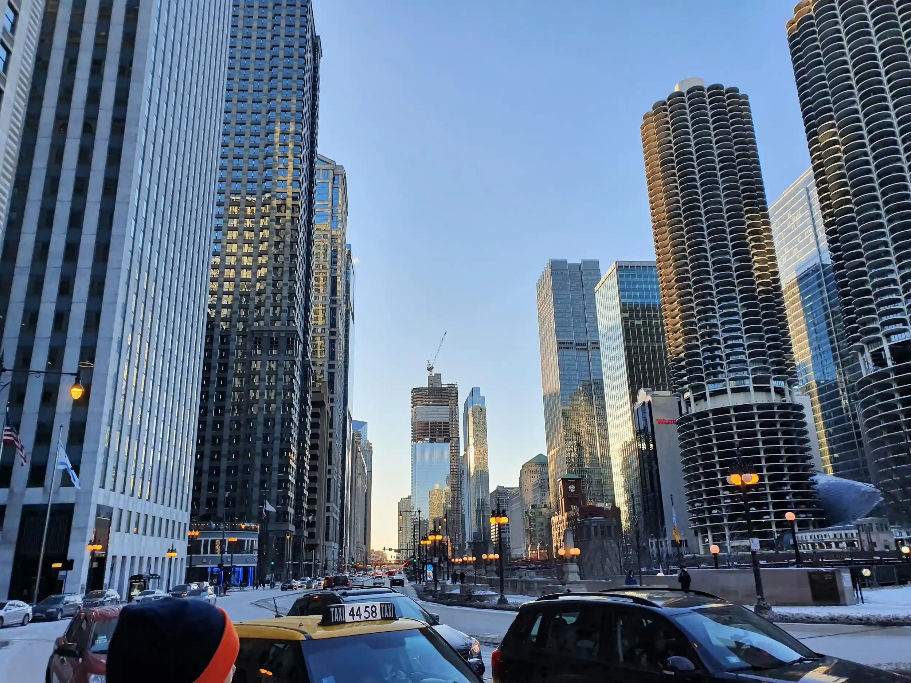  

_Bilder från Miami Beach, Chicago, och Arches National Park._

## Fritid och sociala aktiviteter

Min fritid bestod till stor del av något jag visste att jag ville engagera mig i redan innan jag åkte iväg, vilket var att gå med i och träna tillsammans med universitetets herrlag för Ultimate Frisbee. Det var också en personlig anledning att söka just till Nordamerika, eftersom sporten är mycket större där än i Sverige. UIUC hade över 100 olika klubbar och föreningar som en kunde gå med i, och jag hade faktiskt ögon på bland annat en som handlade om skydiving och en som handlade om road trips. Men i slutändan blev det bara frisbeen för mig, vilket ändå kändes som mer än tillräckligt. Vi hade träning 2 gånger i veckan, och vi åkte även på turneringar, samt att det organiserades olika sociala event av laget under terminens gång. Var även genom klubben jag träffade folk och gjorde andra sociala grejer.

    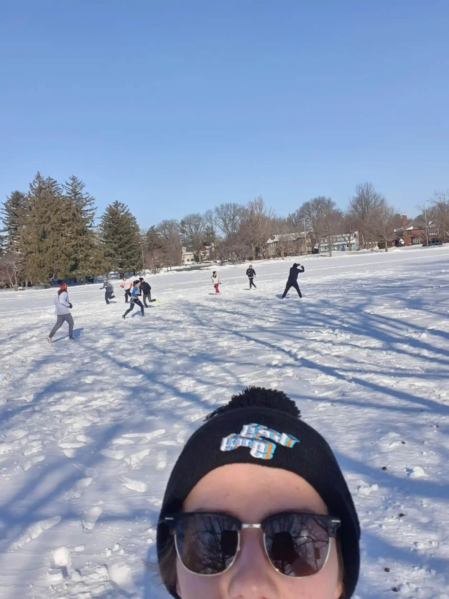
    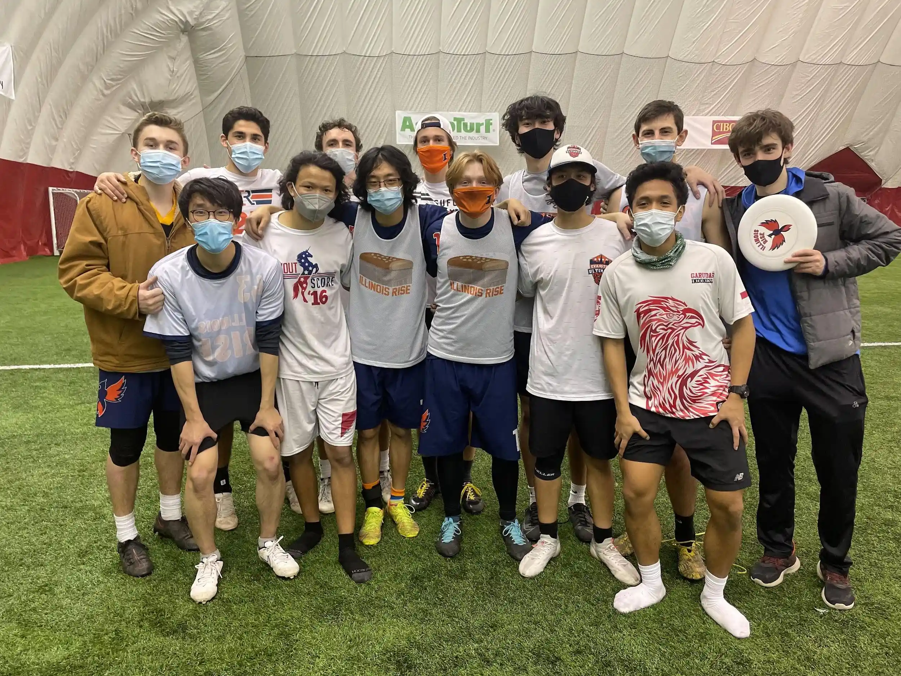  
    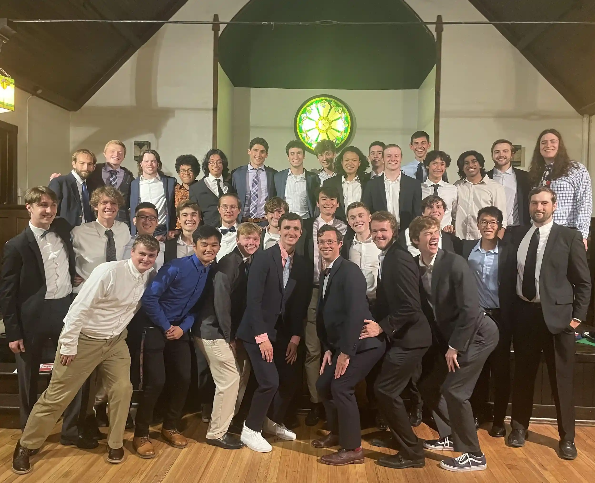  

_Pickup i snön, en natt-turnering i Chicago, och terminens avslutande fest_

I USA är universitets-sporter väldigt stora, och för den intresserade finns det nästan alltid något att gå och titta på. Störst på UIUC är basket och amerikansk fotboll, men på campus går det även att titta på exempelvis baseboll, gymnastik, brottning, softball, eller tennis. Personligen rekommenderar jag de event där de första besökarna får gratis mat eller kläder - är också bättre för ekonomin än de populära som en behöver köpa biljetter till. Som nämnt ovan har vi också full tillgång till skolans gym- och idrottslokaler.

    
    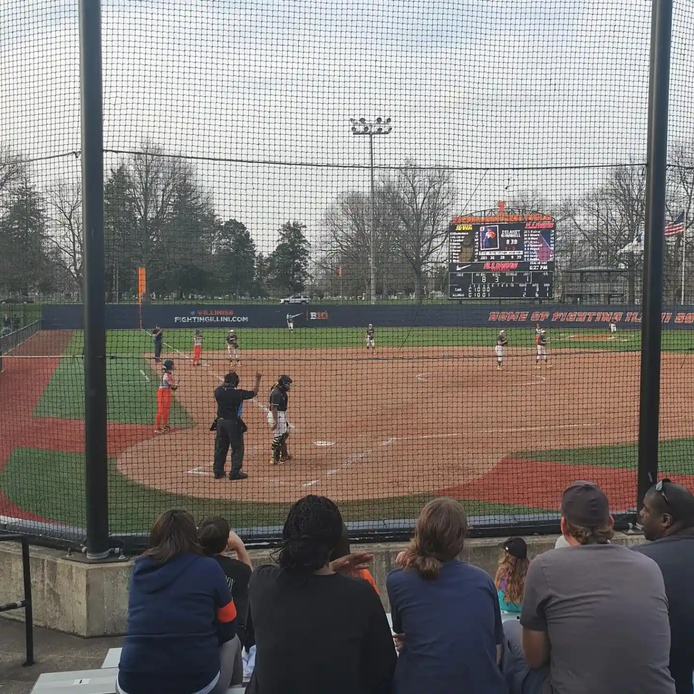  

_Andra universitet kommer och utmanar UIUC inom idrott. Här var jag på tennis och softball_

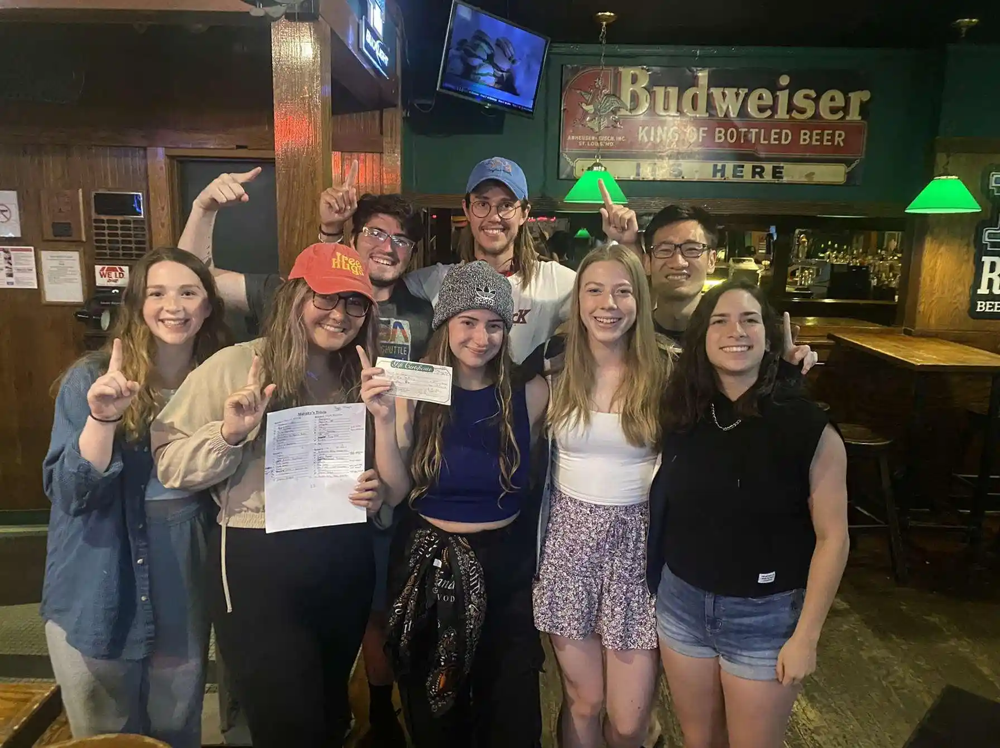

Utöver sport finns det även kring huvudgatan Green Street flertalet populära barer. Den som var av störst intresse för mig var Murphy’s - som hade trivia nights varje måndag. Det fanns även de som hade karaoke- och andra temakvällar. När det kom till Super Bowl var det även till alla barer i närområdet som många drog sig.  
  

Ungefär en gång i månaden anordnades en utbytes-specifik aktivitet av de ambassadörer som agerade faddrar för ingenjörs-utbytesstudenterna. Det var bl.a. en scavenger hunt, tie-dye, skridskoåkning, och lite roddande i anslutning till E-week som hålls av UIUC, vilket är ett event som pågår i en vecka med ingenjörskap som tema. Där finns bland annat experiment och demonstrationer, företag som kommer förbi, en skattjakt, och hela veckan kulminerar i en “Tesla coil concert”.

    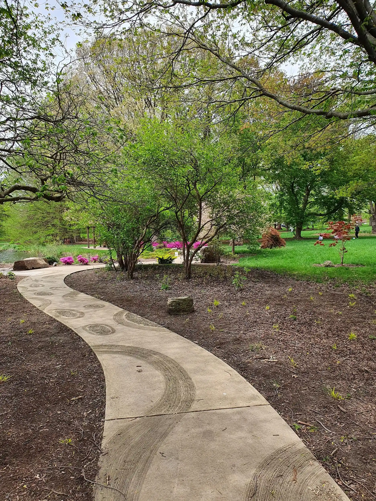
    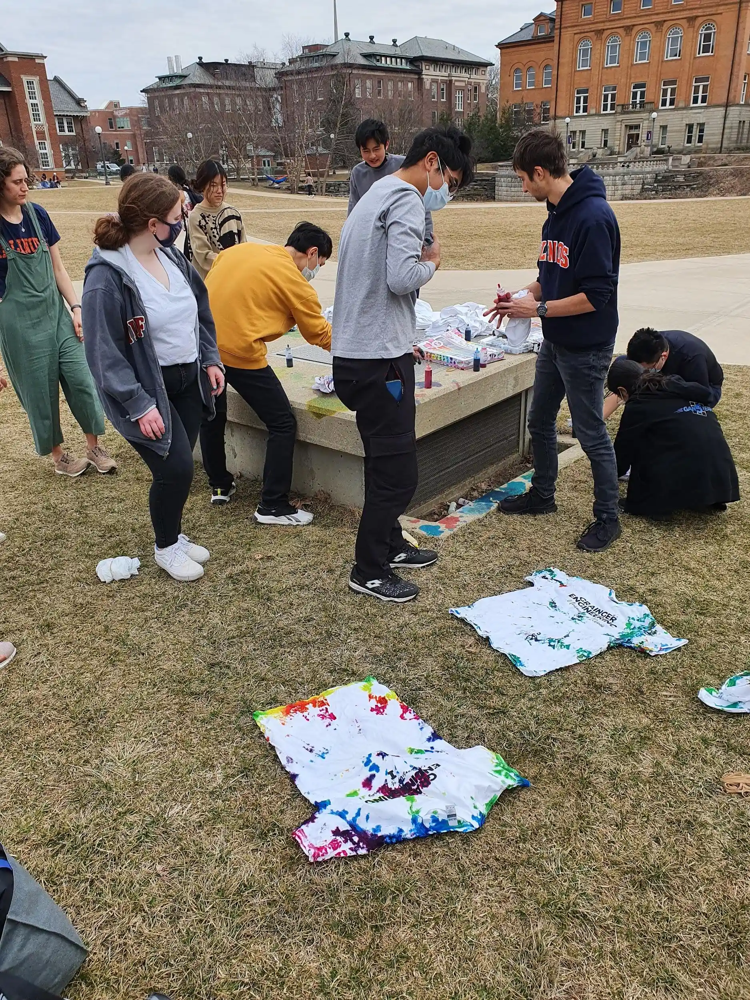  
      

_Blandade bilder - från skolans Japan Gardens, från ambassadörernas Tie-Dye, och från en konsert_

## Hållbarhet

Det som i första hand är värt att nämna vad gäller hållbarhet är att USA är väldigt bil-beroende. Det märks stundvis, både i vilka alternativ jag själv kände att jag hade för att ta mig till ställen, men också hur folk omkring en pratar om det. Under “snöstormen” vi hade en gång också så fick vi ha på distans, eftersom att bilar inte kunde ta sig fram (konsekvens av att de inte hade ordentlig plogning). När det blev lite varmare skaffade jag en begagnad cykel som jag använde för att ta mig runt campus, som var väldigt skön att ha!

## Rekommendationer och övriga reflektioner

Kanske är det så för USA överlag, men iallafall i sådana här mindre campus towns, så finns det en kultur att festa och hänga i barerna mycket. Det finns som beskrivet ovan också mycket annat att göra, men då får en ta lite mer eget initiativ. För många är utgångsläget att gå till en bar när de ska göra något, vilket jag tyckte var lite synd.

Inget du kan förbereda dig på samma sätt till, men det är bra att ha åldern inne. 21 år gäller för att du ska kunna dricka alkohol, och är du över 25 år får du även billigare försäkring ifall du ska hyra bil. Vad gäller bil så underlättar det också mycket ifall du har körkort och således kan köra själv, för att göra sig mer fri i alternativ för att åka dit du vill. Svenskt körkort och pass var det enda som jag behövde.

Något som förvånade mig kraftigt efter hur van jag blivit med hur det är på KTH var bristen av mikrovågsugnar på campus. Efter att ha frågat runt så lyckades jag hitta 2 stycken på hela campus! Den ena var i ett öppet lärarrum i keramik-byggnaden, och den andra var i samhällsbyggs-byggnaden, 2 våningar under marken. Som tur var hade jag lyckats designa mitt schema så att jag alltid började efter lunch eller slutade före, så jag löste det genom att äta hemma bara.

Det är klokt att ha med sig lite kontanter, iallafall på nya platser. Ibland behövs det för att komma in på barer, och att ha som backup ifall ens kort skulle fungera - vilket hände mig strax efter landning när vi skulle köpa mat och tågbiljett i Chicago. Min boendedeposition var också bara i kontanter.

Sist vill jag nog bara säga att ifall du är intresserad av att åka på utbyte så tycker jag att du borde! Jag kände mig väldigt självständig tiden jag var borta, och det var många saker som jag fick lösa på egen hand. Att jag växt som person från att ha varit borta en termin är det ingen tvekan om.
