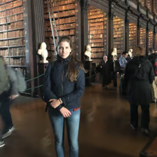
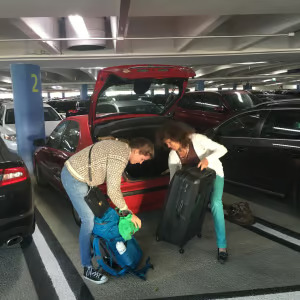
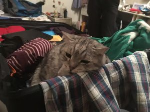
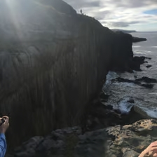
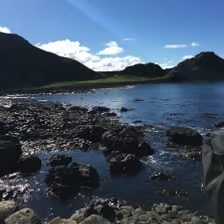

# Camilla Björn - Irland

Universitet: Trinity College Dublin  
Termin: HT 2016  
Inriktning: Fysik (senare Data)

## Innan avresa

Jag visste redan innan jag började på KTH att jag ville åka utomlands, men att det skulle sluta med Irland var inte lika självklart. Valet stod mellan Irland och Singapore ända fram till dagen innan ansökan stängde. När jag stod och valde vilket universitet som skulle få äran om förstaplatsen kändes detta val som ett av de viktigaste jag gjorde under min tid på KTH. Så här med facit i hand tror jag dock att jag hade haft en helt fantastiskt tid var jag än hade hamnat, men i och med att Irland blev mitt slutgiltiga val har jag såklart en viss partisk förkärlek till landet.

Den främsta anledningen till att jag valde Trinity College på Irland var att detta var det enda alternativet för mig att åka på ett Erasmusutbyte till ett engelsktalande land. Jag hade även en romantiserad bild av Irland som ”den gröna ön”, kanske var det alla år som drömmande hästälskare som fick mig att tilltalas så mycket av de öppna fälten? Det var helt enkelt något mysigt över Irland, och möjligheten att få bo i Dublin lät inte heller helt fel. Utan att avslöja allt för mycket i början av denna reseberättelse, så kan jag ju ändå konstatera att jag inte blev besviken!

Efter att ha blivit nominerad av KTH väntade en del extra arbete under den följande våren. I och med att jag åkte inom Europa klarade jag mig undan mycket av det krångel som förberedelserna inför utbytesstudier kan innebära. Jag behövde aldrig ansöka om visum, försäkringen var redan fixad via KTH och mina engelska kunskaper beräknades redan vara tillräckliga (när jag åkte år 2016 räckte det med att jag visade upp slutbetyg i engelskan från gymnasiet). Däremot uppstod en del krångel när det kom till att ansöka till Trinity. Att välja kurser visade sig vara mer jobb än väntat. Även om jag i slutändan inte läste allt som jag hade valt från början var jag väldigt tacksam när jag väl kom till Irland över att jag hade lagt ned en del arbete på att leta kurser. Den största stressen innan resan innebar dock att vänta på antagningsbeskedet från Trinity som inte kom förrän i mitten av augusti. När jag väl fick mitt antagningsbesked bokade jag flygbiljett (efter att ha hunnit besöka Irland några gånger kan jag konstatera att det nästan alltid är billigast att boka med SAS ungdom, om man är under 26). Fixa boende var också något som jag passade på att göra så snart jag hade fått mitt antagningsbesked.

Sen var det dags att packa. Med facit i hand kan jag nog konstatera att jag nog släpade med mig en smula mer packning än nödvändigt. Jag tog med mig två resväskor vilket jag i och för sig inte ångrar, men det innebar en hel del konkande. Min rekommendation är dock att inte fylla bägge till brädden. Kom ihåg att det kommer finnas möjlighet till att tvätta, och du kan nog hitta en billig stekpannan när du kommer fram…
Att skära ned på packningen var svårt och jag tvingads tillslut att plocka ut denna sorgsna varelse ur väskan.

    
      

Mamma agerar taxi till Arlanda och lämnar mig med de visa orden: ”Tänk inte så mycket på skolan, du får ta de poängen sen...”.

## Ankomst

Morgonen den 14e september, fem dagar innan upprop, bar det av till Dublin. Jag hade blivit meddelad om att jag skulle få tillträde till mitt studentrum den 16e, vilket jag löste med AirBnB de två första nätterna. Dublins flygplats ligger ganska nära stan och det finns flera olika bussförbindelser. Värt att notera är att det oftast bara går att betala kontant (oftast enbart med jämna mynt) eller med förköpta biljetter på bussarna. Att ta sig från flygplatsen via buss med två tunga resväskor är inte den mest bekväma lösningen, men fullt möjligt och kan ju kanske ses som en skojig utmaning.

Den 19e september höll Trinitys rektor tillsammans med studenthälsa, utbyteskoordinatorer och kåren välkomsttal för oss nya europastudenter och därefter fick vi möta upp med våra student-to-student (S2S) grupper (motsvarande KTHs Buddies) för en campus tur och lite lära-känna träff. Resten av veckan innehöll rätt lite aktiviteter för oss nya internationella studenter. Denna första vecka under höstterminen på Trinity gick under namnet ”freshers week” och påminner till viss del om en av mottagningsveckorna på KTH. Största fokuset ligger alltså på de nya ettorna, men vi internationella studenter fick också köpa biljetter till de stora festerna som anordnades. Under hela Freshers week var Trinitys front square (typ deras borggård) fylld av stånd där de olika societies och clubs försökte värva medlemmar. Tipset vi fick var att tänka efter innan vi gick med, för även om medlemskostnaden ofta var låg hade många för ovana att gå med i långt fler societies än vad de utnytjade vilket kunde bli rätt dyrt. Viktigast under freshers week var ändå att anmäla sig till de kurser som man skulle läsa. Den största skillnaden mot KTH var att inga schemakrockar var tillåtna! Anmälan var också tvungen att göras för hand och alla önskemål om kurser var tvungna att godkännas med en signatur av den ansvariga professorn. Detta var en rätt stressig och tidskrävande process, men alla på Trinity var mycket hjälpsamma och försäkrade mig ständigt om att allt skulle bli bra, trotts att flera av mina planer hade spruckit timmar innan deadline. ”It’ll be grand. Have a chrisp!” svarade min koordinator och sträckte fram sin chipspåse, när jag panikslaget berättade om mina problem att hitta kurser som inte krockade, inte redan var fulla och helst skulle kunna tillgodoräknas på KTH, några timmar innan deadline. Hon hade rätt, och det fortsatte hon ha under resten av terminen. Det blev en av mina största livserfarenheter från Dublin, det mesta ordnar sig faktiskt.

## Ekonomi

I och med att jag åkte på ett Erasmus utbyte fick jag erasmusbidraget. Jag behövde aldrig betala några extra utgifter till Trinity, inte ens för att få tillgång till deras idrottsanläggning, något som de inhemska studenterna behövde göra. Tur var väl det kanske, Dublin är en rätt dyr stad, med betydligt högre hyror på studentlägenheterna.

Förutom att lägga lite tid på att hitta boende är nog mitt största ekonomiska tips att köpa en cykel. Att åka kommunalt i Dublin är JÄTTEDYRT! Räkna med att lägg €80 (inklusive studentrabatt) i månaden på att åka kommunalt under förutsättningen att du inte har gångavstånd till det allra mesta. Lokaltrafiken är inte heller något att hurra för. Förutom att det kan vara kul att sitta på övervåningen i dubbeldäckarna och det faktum att det faktiskt finns lokaltrafik, är den inte särskilt bra jämfört med Stockholms. Bussarna slutar för det mesta att gå ca 23.30 och nästan alla linjer utgår från stadskärnan vilket innebär att det inte är ovanligt att du behöver åka in till stan för att byta buss för att sedan åka i nästan samma riktning som du kom från. Förutom att tjäna in en hel del pengar på att köpa cykel, tjänade jag in galet mycket tid. Att åka taxi är billigare än hemma, men det kan ju bli dyrt i långa loppet…

## Boeende

Jag hade turen att bli erbjuden en studentlägenhet vid Marino Institut of Education. Hyran låg på nästan 9000 kr/månaden, vilket kändes lika orimligt då som nu, men i och med att jag fick mitt antagningsbesked så sent och inte hade möjlighet att åka till Dublin för att leta boende tidigare, samt att jag bara skulle stanna i ca 3 månader valde jag att tacka ja. Jag fick senare reda på att jag hade haft rätt tur som hade blivit erbjuden ett boende från Trinity, i synnerlighet eftersom jag bara skulle stanna en termin. De studenter som skulle stanna ett helt läsår erbjöds ofta att bo i Trinitys studentlägenheter i Trinity Halls. När jag började på Trinity rekommenderade de att vi internationella studenter anlände två till tre veckor innan terminsstart för att leta boende. Många av mina internationella vänner bodde på vandrarhem eller andra tillfälliga boenden i början medan de letade permanenta boenden. Lite stressigt när terminen startade, men det är också ett alternativ. Freshers week är en helt ok tid att leta boende. Det finns många facebook grupper att gå med i där människor (ofta från olika länder) letar medboende till sina lägenheter och hus. Trinity har även en sida där irländska familjer hyr ut rum och då ingår ofta mat.

## Universitetet och studierna

Att plugga vid Trinity är en upplevelse i sig! Efter lite googlande kom jag fram till att Trinity har ungefär lika många studenter som KTH, men Trinitys campusområde är mycket mindre och ligger mitt i stadskärnan (jag tror till och med att många skulle definiera stadskärnan som Trinity). Trinity är en av Irlands största turistattraktioner, vilket märks och kan vara en konstig upplevelse som student. Det tog ett tag innan jag vande mig vid att behöva tränga mig förbi horder av turister på väg till mina föreläsningar. Jag måste finnas på åtskilliga semesterfoton…

En stor skillnad mellan Trinity och KTH är att Trinity inte är ett tekniskt universitet, utan har program inom allt från naturvetenskap, samhällsvetenskap och humaniora till medicin. Detta innebär att Trinitys ingenjörsskola är förhållandevis liten och det är väldigt sannolikt att du får möjlighet att umgås med studenter från helt andra program.

Jag var överlag väldigt nöjd med undervisningen på Trinity, hade oturen att ha en ökänd lärare, men vilket universitet har inte såna? Den största skillnaden var nog att elever inte var vana att använda kurslitteratur. Jag var nog en av de enda som följde listan med den rekommenderad kurslitteraturen som vi fick i början av terminen, och det visade sig vara ganska onödigt. Det var föreläsningsanteckningar och eget sökande som gällde. Vi hade inte heller särskilt många övningar, däremot var det vanligt med en läxa varje eller varannan vecka som skulle lämnas in och påverkade slutbetyget (för det mesta positivt).

En vanlig dag på Trinity började som tidigast klockan nio och slutade som senast vid fem, men det var ytterst ovanligt att ha hela dagen fullspäckad med föreläsningar. Vi hade samma schema varje vecka (vilket jag tyckte var ganska skönt) och föreläsningarna höll nästan alltid på i 50 minuter (de sista 10 minerarna var för att byta klassrum). Lunchen hade vi när vi hade tid, vilket om en hade otur kunde vara väldigt tidigt eller VÄLDIGT sent, men oftast löste det sig. Den vanligaste lunchtiden var mellan ett och två, något som jag blev påmind om alla de gånger som jag väntade till klockan ett (när den svenska lunchen är slut) för att uppsöka min koordinator…

All undervisning var på engelska, men en får räkna med en uppsjö av dialekter, inte bara irländska. För det mesta var det ganska lätt att hänga med, men för mig tog det nog ca två veckor innan jag vande mig med de flesta ”alternativa” uttalen. Jag satt som ett frågetecken under en halv mekanikföreläsning medans min föreläsare pratade om ”the vector [or]…”, tills jag insåg att bokstaven ”R” uttalas ”or”.

Jag hade även möjlighet att läsa en grundkurs i irländska, vilket jag passade på att göra, men med tanke på att många av irländarna själva inte talar språket vill jag påstå att det absolut inte är nödvändigt att försöka lära sig det (förutom att det kan vara intressant!).

## Kurser

Jag hade turen att läsa hälften av mina kurser tillsammans med en klass, vilket jag är oerhört tacksam för eftersom det innebar att jag hade möjlighet att få ett gäng irländska (och två franska) klasskompisar. Annars är det vanligt som internationell student att en hoppar omkring och läser kurser med olika klasser. Det är naturligtvis inget fel med det, men det kan vara svårare att hitta klasskompisar. De kurser som jag läste var:

-   Equations of Mathematical Physics
-   MA2223 Metric spaces
-   MA2327 Ordinary Differential
-   MA2341 Advanced Classical Mechanics I I (vilken jag hoppade av efter ett tag)
-   Irish Litterature

Mekanikkursen visade sig vara betydligt svårare än den (SG1113 Mekanik, fortsättningskurs) jag skulle ha läst på KTH. Min lärdom var att det inte alltid är så lätt att bedöma kursernas svårighetsgrad utifrån kursbeskrivningarna. Om en är väldigt intresserad av ganska teoretisk mekanik, så kanske kursen är att rekommendera?

Irish Litterature var en jätterolig kurs, men eftersom vi bara har villkorligt valbara poäng på CL har jag inte bekymrat mig om att försöka tillgodoräkna mig den. Hur som helst lärde jag mig en del om kulturen och det var också en viktig del av utbytet för mig.

## Staden och landet

Frusen nykterist på Irland… Många hade sina misstankar om att jag kanske inte hade tänkt igenom mitt universitetsval så noga. Min bästa vän gav mig lite retsamt ett paraply dagen innan jag skulle åka, men det visade sig att hon hade fel. Min termin var visserligen ovanligt torr, men om en är van vid de kalla slaskhöstarna i Stockholm var hösten i Dublin rean rama solsemestern. Det visade sig också vara alldeles för blåsigt för att kunna använda paraply.

Min erfarenhet är att Irland är inte så blött som många tror, men nog finns det en anledning till att det är så grönt… När det kom till alkoholen så är det klart att jag nog ”missade” något, men jag kan inte klaga på publivet. De flesta av mina favoritpubar serverade villigt te och jag kan inte minnas att jag var på någon hemmafest där det inte fanns tillgång till vattenkokare och mjölk (tepåsarna låg givetvis i säkert förvar i väskan). Hursomhelst, för er som inte är oroliga över att ni inte kommer ha konstant tillgång till te så kan jag garantera att det även finns annat att dricka. Jag kan tyvärr inte ge någon personlig recension av alkoholen. De jag pratade med var dock mycket nöjda med ölsortimentet, kanske i synnerlighet Guinnessen som testas kontinuerligt utav en särskild Guinnessprovsmakare som åker runt mellan pubarna.

Jag blev snabbt ett stort fan av staden. Den beskrevs av många som ett litet och något mysigare London, och jag kan inte mer än att hålla med! Staden är fantastiskt mysig och en behöver inte åka långt för att komma ut på landsbygden. Det räcker med att ta Darten (deras pendeltåg) till någon av hållplatserna i utkanten av linjen (yes, det är bara en linje…) för att hitta fantastiskt mysiga hajkområden. Min personliga favorit är halvön Howth, men promenaden mellan Bray och Gray Stones är också jättemysig. Ungefär 50 km från Dublin ligger Glendalough som också är en jättemysig utflyktsplats. Passar perfekt för dagsutflykter! Egentligen passar nästan alla ställen på Irland bra för dagsutflykter eftersom ön är så pass liten, men om en vill spendera lite mer tid någon stans kan det ju så klart vara trevligt att övernatta. För utflyktsmål lite längre bort från Dublin så kan jag varmt rekommendera Belfast, Giants Cause Way, Galway och Cork! Alla tre är typiska turist resemål, men värda att se. Det är många ställen som jag inte han besöka, Cliffs of Moher ska tydligen vara värt ett besök, men det finns många ställen på Irland som påminner om Cliffs of Moher, men med färre turister…

## Fritid och sociala aktiviteter

En stor del av min fritid spenderade jag med mina vänner från Trinitys klätterklubb. Trinity hade en klättervägg på campus som vi hade träningar vid på tisdag och torsdag kvällar och efteråt gick vi ofta till antingen campuspuben eller en pub alldeles bredvid campus. Utöver tisdags och torsdags träningarna anordnade klubben många andra aktiviteter. Den bästa var helt klart resan till the Burren under reading week (deras höstlovsvecka). Vi var ett 40 tal studenter som åkte dit i en hyrd buss och bodde tillsammans i husvagnar som vi hyrde på en kamping i närheten av klippan där vi klättrade. Det är tveklöst den minst glamorösa resa jag varit på, men det var fantastiskt roligt och ett bra sätt att både lära känna folk och se naturen.

Förutom klätterklubben som jag var en ganska aktiv medlem i gick jag även med i den internationella föreningen som anordnade resor för internationella studenter. Med dem åkte jag bland annat till Giants Cause Way, en as cool plats som jag absolut tyckte var värd att se trots trängsel med alla andra turister!

## Rekommendationer och övriga reflektioner

På tal om vad som går att dricka i Dublin…Kranvattnet går att dricka utan risk för hälsoproblem, men om du inte gillar att dricka vatten som smakar simbasäng så rekommenderar jag att köpa en vattenflaska med inbyggt filter! De finns på många ställen, men som student vid Trinity får du rabatt hos Eason…
